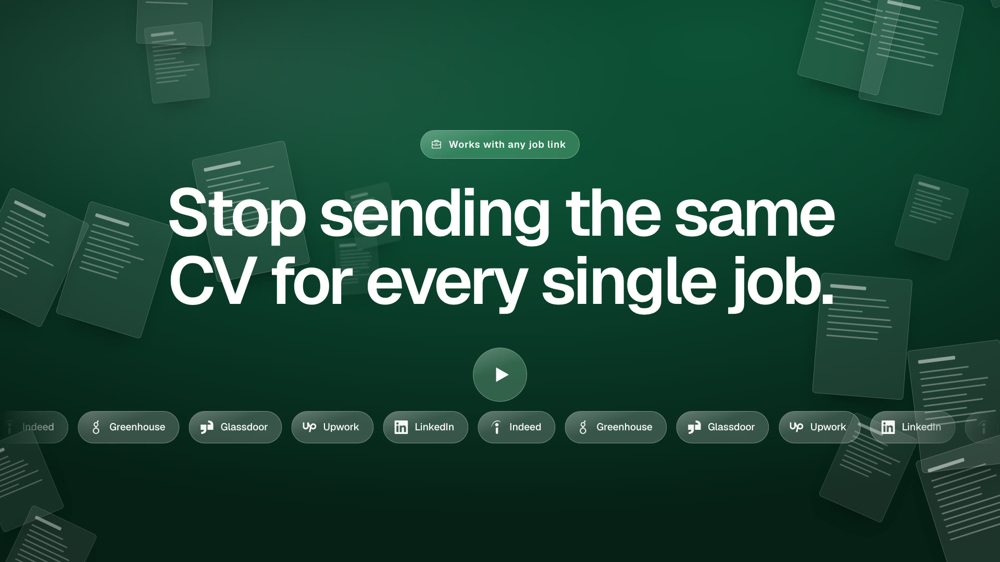
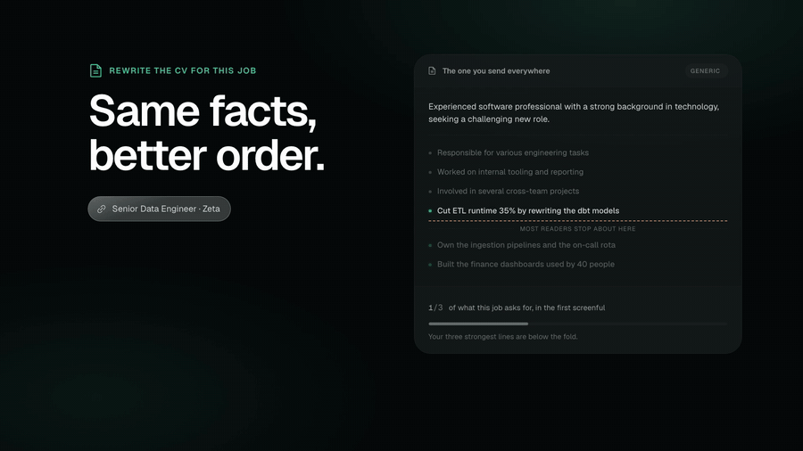
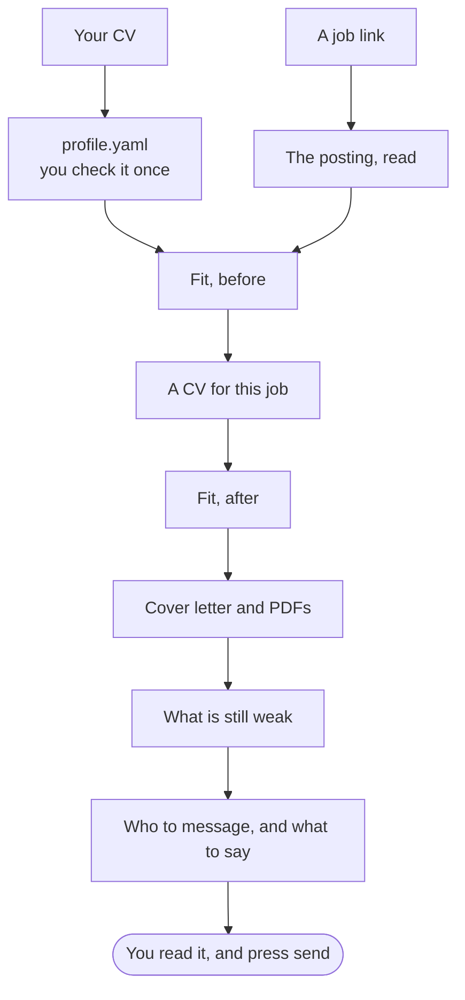

<div align="center">


# jobhunt

**Stop sending the same CV for every single job.**

Eleven skills for the coding agent you already use. Paste a job link, and get a
CV built for that posting, the people worth messaging, and the message to send
them, all from your own work.

[](https://github.com/mohamedaminehamdi/job-hunter/actions/workflows/ci.yml)
[](#install)
[](#install)
[](#license)

**[Install](#install)** · [How it works](#how-it-works) · [The eleven skills](#the-eleven-skills) · [FAQ](#faq) · [Website](https://mohamedaminehamdi.github.io/job-hunter/)

<sub>Works with Claude Code, Codex, Gemini CLI, Cursor, Cline and Windsurf, on macOS and Linux.</sub>

<a href="https://mohamedaminehamdi.github.io/job-hunter/assets/launch.mp4"></a>

</div>

## What it does

**One profile, every job.** Every role, project and side thing, across every
field you have worked in, lives in one file. You write it once and each
application draws from it, so you never retype your history.

**A CV per job, without the evening.** It reads the posting, checks every
requirement against your own work, and leads with the lines this job asks for.
Same facts, better order:

<p align="center"></p>

Most readers stop after the first screenful. On the one CV you send everywhere,
your strongest three lines were below it.

**Who to message, and what to say.** It works out who at the company is worth
contacting (alumni first, because they are the ones who reply), builds the
searches that find them, and drafts a note specific enough to answer.

**Your facts, your send button.** The CV is built from what is already in your
profile. It does not apply for you, log in as you, or send anything: you read
it, and you press send.

## Install

| Agent | How | Where it reads skills from |
|---|---|---|
| Claude Code, Codex | the plugin, or the one-line script | your home folder, so every project |
| Gemini CLI | the one-line script | your home folder, so every project |
| Cursor, Cline, Windsurf | the script with `--to` | only the folder you have open |

**Claude Code or Codex**, as a plugin, at the prompt:

```text
/plugin marketplace add mohamedaminehamdi/job-hunter
/plugin install jobhunt@jobhunt
```

**Any agent**, from a terminal on macOS or Linux. It finds the agents you have
and installs into each:

```bash
curl -fsSL https://raw.githubusercontent.com/mohamedaminehamdi/job-hunter/main/install.sh | sh
```

**Cursor, Cline or Windsurf** read skills per project, so run it in the folder
you keep for your job search, with `--to .cline` or `--to .windsurf` for those:

```bash
curl -fsSL https://raw.githubusercontent.com/mohamedaminehamdi/job-hunter/main/install.sh | sh -s -- --to .cursor
```

<details>
<summary><b>Just some of the skills</b>, a dry run, or removing them</summary>

Each skill works on its own, so you can take only the ones you want:

```bash
curl -fsSL https://raw.githubusercontent.com/mohamedaminehamdi/job-hunter/main/install.sh | sh -s -- --only jobhunt-review,jobhunt-fit
```

`--list` shows what would be installed and where, and changes nothing.
`--uninstall` removes them again.

</details>

<details>
<summary><b>No terminal</b></summary>

[Download all eleven](https://github.com/mohamedaminehamdi/job-hunter/releases/latest/download/jobhunt-all.zip),
unzip it, and put the folders in `~/.claude/skills/`, `~/.codex/skills/`,
`~/.gemini/skills/`, or your project's `.cursor/skills/`. Make the directory if
it is not there yet. The [latest release](https://github.com/mohamedaminehamdi/job-hunter/releases/latest)
has each skill as its own zip too.

</details>

**What it needs:** Python 3.9 or newer, which macOS and every Linux already
has, and Chrome, Chromium, Edge or Brave for reading job pages and making PDFs.
No API key: your agent is the model, so whatever you already pay for covers it.

<details>
<summary><b>Optional:</b> LaTeX for the PDFs</summary>

If you have a TeX engine (`tectonic` is a single binary), CVs and letters are
set in LaTeX instead, which is what most people expect a CV to look like, and
it is several times faster. Nothing needs it: with no engine the browser renders
them exactly as before, and the tool tells you which it used.

</details>

## How it works



Put your CV somewhere, open your agent in a folder you want to work in, and
say what you want:

> prepare an application for https://boards.greenhouse.io/acme/jobs/42

The first run reads your CV, writes `jobhunt/profile.yaml`, and **stops and
asks you to check it**. A model just read your career; you approve it once, and
everything after is built on facts you have agreed to.

Then every job gets its own folder:

```text
jobhunt/runs/2026-09-24-acme-senior-data-engineer/
├── fit-before.md     how your CV answered this job as it stood
├── cv.pdf  cv.md     the tailored CV
├── letter.pdf .md    the cover letter
├── fit-after.md      what the tailoring actually bought
├── critique.md       what is still weak in both
├── outreach.md       who to message, the searches to run, what to say
└── job.yaml          the posting, as read
```

You can also ask for one part on its own:

| Say | Runs |
|---|---|
| how good is my CV? | `jobhunt-review` |
| how well do I match https://boards.greenhouse.io/acme/jobs/42 | `jobhunt-fit` |
| help me answer "Do you have experience with Kafka?" | `jobhunt-answer` |
| who should I contact about this job? | `jobhunt-outreach` |

<details>
<summary>What a note in <code>outreach.md</code> looks like</summary>

The site's example, in the format the skill writes:

> **Connection note** (188 of 280 characters — LinkedIn rejects anything longer)
>
> Hi Lena - fellow TU Berlin grad here. I rewrote a dbt warehouse and cut ETL
> runtime 35%, and saw Zeta is hiring a data engineer. Would you have 10
> minutes to tell me what the team is like?

</details>

## The eleven skills

Each works on its own. Install just the review to score your CV, or just the
fit score to decide whether a job is worth an evening.

| Skill | What it does |
|---|---|
| `jobhunt` | the whole thing, in order |
| `jobhunt-profile` | your CV → one YAML file everything else reads |
| `jobhunt-review` | score the CV on its own, with no job description |
| `jobhunt-posting` | a job URL → structured posting, in your own browser |
| `jobhunt-fit` | how well you match, before and after |
| `jobhunt-tailor` | a CV for this job, out of what you have already done |
| `jobhunt-letter` | three or four paragraphs worth reading |
| `jobhunt-pdf` | the files to attach |
| `jobhunt-answer` | form questions, including how to write an honest no |
| `jobhunt-outreach` | who to message, and what to say |
| `jobhunt-critique` | what's still wrong, before you send it |

## Roadmap

- [x] A tailored CV, a cover letter, a fit score and outreach, from one job link
- [ ] **One-click apply**, on the boards that allow it
- [ ] **Jobs found for you**: postings your profile already answers
- [ ] **Application tracking**: what you sent, when, and what came back. Until
      then, `runs/log.md` has one line per run; it is markdown, so type what
      happened next into it.

Not built yet: today it prepares the application, and you send it. Want one
sooner? [Suggest it](https://github.com/mohamedaminehamdi/job-hunter/issues/new?template=idea.yml).

One thing is not on the roadmap: **scraping LinkedIn.** LinkedIn walls and
throttles automated access, and the risk lands on *your* account. It builds the
searches; you run them.

## FAQ

<details>
<summary><b>Will it make things up?</b></summary>

The CV is assembled from your profile: the roles in it are picked from yours,
and a skill the model adds that your profile does not list is dropped, and you
are told. If the tailored CV still names something your profile does not back,
the after score flags it as `claimed but not evidenced`.

</details>

<details>
<summary><b>Will it make my CV good?</b></summary>

It will make your CV **accurate**, and put your strongest evidence where a
reader meets it. It cannot give you experience you do not have, and it will
tell you plainly when a job needs some.

</details>

<details>
<summary><b>Where does my CV go?</b></summary>

Into `jobhunt/`, in the folder you work in. There is no account and no server,
and nothing is uploaded anywhere by jobhunt itself. Your agent reads it, on the
same terms as anything else you show it.

</details>

<details>
<summary><b>Do I need to pay for anything?</b></summary>

No. Your coding agent is the model, so whatever you already pay for covers it.
There is no provider to sign up to and no token bill.

</details>

<details>
<summary><b>Can I just use one skill?</b></summary>

Yes. Each folder carries its own copy of the library and imports nothing from
its siblings, so one installed alone works exactly the same as all eleven. See
[Install](#install) for `--only`.

</details>

## When it goes wrong

| What you see | What it means |
|---|---|
| `No Chrome, Chromium, Edge or Brave found` | Install any of them, or set `JOBHUNT_BROWSER`. You still get markdown without one |
| `Only 300 characters came back` | The posting is behind a login wall. Paste the description — that path is fully supported |
| `No profile at ...` | Put a CV somewhere and ask for a profile first |
| `is YAML this reader does not do` | Hand-edited `profile.yaml` using a `{a: b}` map. Use block style |
| The fit score says `0 of 0` | The posting stated no requirements, so it fell back to keywords. Coarser, and it says so |
| `No TeX engine found` | You asked for a LaTeX template and there is no engine. Install `tectonic`, or set `JOBHUNT_TEX`. The markdown was still written |

Something else? [Open an issue](https://github.com/mohamedaminehamdi/job-hunter/issues/new?template=bug.yml)
with what you ran and what came back, and leave your CV out of it.

## Contributing

See [CONTRIBUTING.md](CONTRIBUTING.md), and [AGENTS.md](AGENTS.md) for how the
repo is laid out. `pytest` runs the suite, on Python 3.9 and up.

If jobhunt saved you an evening, a star helps the next person find it.

## License

[PolyForm Noncommercial 1.0.0](LICENSE), with one addition: anyone may use it
to look for work for themselves, paid work included. It is not for commercial
use — recruiters, agencies, employers, CV or coaching services, and paid
products need a separate license from the author. Every skill carries a copy
of the [LICENSE](LICENSE).

Earlier versions were released under MIT, and copies of those stay MIT.

## Credits

The launch video was made with [/brag](https://github.com/latent-spaces/brag).
Type is [Geist](https://vercel.com/font), and the icons are
[Phosphor](https://phosphoricons.com/). The README borrows ideas from
[awesome-readme](https://github.com/matiassingers/awesome-readme).
